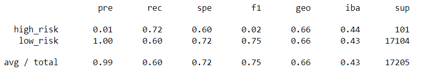

# Credit_Risk_Analysis
_____

To employ different techniques to train and evaluate models with unbalanced classes, we oversample the data using 
the RandomOverSampler, SMOTE algorithms, and under-sample the data using the ClusterCentroids algorithm.  
Also, we used BalancedRandomForestClassifier and EasyEnsembleClassifier, to predict credit risk. Using different techniques can be valuable 
when modeling bias is concerned and to generate accurate information with the given data. 

## Overview of the Credit Risk Analysis:
### Credit Risk Resampling Techniques Used:

#### _RandomOverSampler:_

 Random oversampling involves randomly duplicating examples from the minority class and adding them to the training dataset. 

#### _SMOTE_

The synthetic minority oversampling technique is an oversampling approach that deals with unbalanced datasets.  The SMOTE is not generating duplicated datasets, but rather creating synthetic data points that are slightly different from the original data point. It draws a random sample from the minority class. 

####  _ClusterCentroids:_ 

 This technique involves under-sampling by generating centroids based on clustering methods.  A centroid is a vector that contains one number for each variable, where each number is the mean of a variable for the observations in that cluster. 

#### _SMOTEENN:_

 The SMOTEENN can be explained as a class performing over-sampling using SMOTE and cleaning using ENN, Combining over and under sampling using SMOTE, and editing Nearest Neighbors. 

#### _BalancedRandomForestClassifier:_ 

 The BalancedRandomForestClassifier is a balanced random forest randomly under-samples each bootstrap sample to balance it, by iteratively drawing a bootstrap sample with equal proportion of data points from both the minority and the majority class. 

#### _EasyEnsembleClassifier_

 The EasyEnsembleClassifier allows bad AdaBoost learners which bagging methods build several estimators on a different randomly selected subset of data. However, this classifier does not allow to balance of each subset of data and tends to favor the majority classes. 

## Credit Risk Analysis Results:
 - Data - The Analysis done with credit record of low risk - 68,470 and high risk - 347 & 95 columns
 - Analysis : 
   - Calculated the balanced accuracy score  
     **Confusion Matrix:**

		|  | Predicted Positive  | Predicted Negative |
		| ------------- | ------------- | ------------- |
		| Actual Positive | True Positive (TP)   | False Negative (FN) |
		| Actual Negative | False Positive (FP)  | True Negative (TN)  |
 
	
#### Imbalanced classification report 
- Precision (pre) : The ratio of correctly predicted positive classes to the total number of positively predicted classes
  - Precision = TP/(TP+FP)
- Recall (rec) : Sensitivity and True positive Rate - the ratio of correctly predicted positive classes to the total actual positive classes 
  - Recall = TP/(TP+FN)
- Specificity (spe)- True Negative Rate - the ratio of correctly predicted negative classes to the total actual negative classes
  - Specificity = TN/(TN+FP)
- F1-score (f1)- The harmonic mean of precision and recall
  - F1-score = 2 * Precision*Recall/(Precision+Recall)
- Geometric Mean (geo) - the square root of the product of Recall and Specificity
  - Geometric Mean = sqrt(Recall * Specificity) or Geometric Mean = sqrt(True Positive Rate * True Negative Rate)
- Index Balanced Accuracy (iba) - The metric for measuring performance
  - IBA = (1 + α * (Recall-Specificity)) * (Recall * Specificity)
- Support - support
 
#### RandomOverSampler (oversampling algorithm)
- Calculated the balanced accuracy score : 0.6620175698580149
- Confusion Matrix of 

	|  | Predicted Positive | Predicted Negative |
	| --- | --- | --- |
	| Actual Positive  | 73  | 28 |	
	| Actual Negative | 6820  | 10284 |
	
- Imbalanced classification report of

#### SMOTE
- Calculated the balanced accuracy score : 0.6568196079430206
- Confusion Matrix of 
	|  | Predicted Positive | Predicted Negative |
	| --- | --- | --- |
	| Actual Positive | 62  | 39 |	
	| Actual Negative  | 5135  | 11969 |
	
- Imbalanced classification report of
	
	
	
####  ClusterCentroids
- Calculated the balanced accuracy score : 0.5447339051023905
- Confusion Matrix of 
	|  | Predicted Positive | Predicted Negative |
	| --- | --- | --- |
	| Actual Positive | 70  | 31 |
	| Actual Negative | 10324  | 6780 |

- Imbalanced classification report of
	
	
	
#### SMOTEENN 
- Calculated the balanced accuracy score : 0.6778933652252035
- Confusion Matrix of
	|  | Predicted Positive | Predicted Negative |
	| --- | --- | --- |
	| Actual Positive | 79  | 22 |
	| Actual Negative | 7293  | 9811 |

- Imbalanced classification report of
	

	
#### BalancedRandomForestClassifier
- Calculated the balanced accuracy score : 0.7885466545953005
- Confusion Matrix of 

	|  | Predicted Positive | Predicted Negative |
	| Actual Positive | 71  | 30 |
	| Actual Negative | 2153  | 14951 |
	
- Imbalanced classification report of
	
	
	
#### EasyEnsembleClassifier 
- Calculated the balanced accuracy score : 0.9316600714093861
- Confusion Matrix of 
	|  | Predicted Positive | Predicted Negative |
	| Actual Positive | 93  | 8 |	
	| Actual Negative | 983  | 16121 |

- Imbalanced classification report of
	
	
	
## Credit Risk Analysis Summary:
	
- 
The precision (a measure of how reliable a positive classification is)high_risk of 0.01 and low_risk 1.00 remained the same on over sampling classes / under-sampling classes / and the combination, however, the average of recall obtained 	In each class, the results of the Calculated the balanced accuracy score shows that the Combination sampling scored the best among those three samplings and least on under
	samplings

	
- 
The comparing two ensemble algorithms, Balanced Random Forest Classifier vs. Easy Ensemble AdaBoost Classifier, shows that 
	the Easy Ensemble AdaBoost Classifier has the higher balanced accuracy score (about 93%). It seems that both had the higher score on the high-risk side (EasyEnsembleClassifier is higher), and the Sensitivity and True positive Rate (rec) tends to be higher than the previous samples, especially on the Easy Ensemble Classifier and it was notably high (Over 90 %). This is probably caused by its nature of the classificatin (This classifier does not allow to balance of each subset of data and tends to favor the majority classes)

- 
 While sensitivity identifies teh rate at which observations from the positive class are correctly predicted, precision indicates the rate at  which positive predictions are correct. Also specificity is good measure at avoiding false alarms.  Which test is good will be determined which aspect the customer is focus on, sensitivity, accuracy, and precision can be a role to determine which prediction is best for them.
	
- 
 We noticed that the feature importance showed that the influence over 0.05% classes is related to the total payment (total_rec_prncp, total_pymnt, total_pymnt_inv, total_rec_int, last_pymnt_amnt). 

